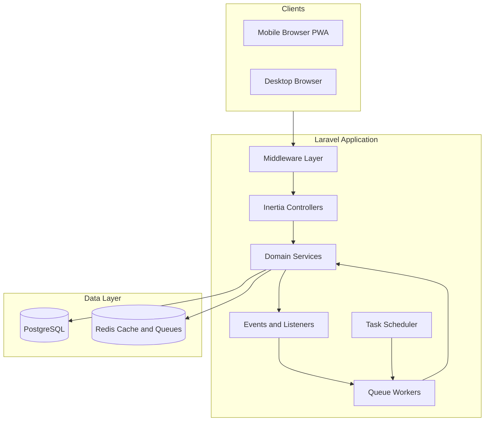
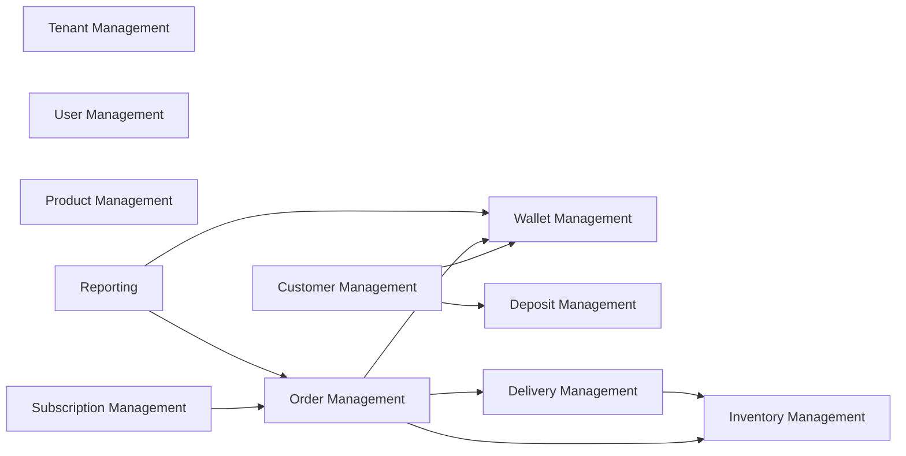

# System Architecture

**Stack:** Laravel 13, PHP 8.4, PostgreSQL, Redis, React 19, Inertia v3, Tailwind v4, shadcn/ui, Spatie Permission v8 (teams disabled).

**Confirmed decisions:**

- Customers have a login portal (Customer role) for self-service
- Spatie teams stay **disabled**; tenant isolation via `tenant_id` + global scopes + policies
- Single DB, shared schema, single domain, no tenancy package
- Open source now, SaaS-ready later

---

## High-Level Architecture



**Request flow:** Browser → Nginx/Apache → Laravel middleware (`SetTenant`, `auth`, `verified`, `permission`) → thin Inertia controller → domain service → Eloquent (tenant-scoped) → response as Inertia page props or redirect.

**Deployment target:** Single Laravel app, horizontal scaling via stateless web nodes + dedicated queue workers + Redis + PostgreSQL. Future SaaS adds tenant onboarding UI and platform Super Admin — no architectural split required.

---

## Backend Architecture

| Layer | Responsibility |
|-------|----------------|
| **HTTP (Controllers)** | Route handling, authorize via policies, validate via Form Requests, delegate to services, return Inertia responses |
| **Actions** | Single-purpose orchestration (e.g. `CreateCustomerAction`, `AssignDeliveryAction`) — thin wrappers callable from controllers, jobs, commands |
| **Services** | Core business logic, transactions, domain rules |
| **DTOs** | Typed input/output contracts between layers (no raw arrays in service signatures) |
| **Models** | Eloquent entities, relationships, scopes, casts — no business logic beyond simple accessors |
| **Policies** | Authorization per model/action, combined with Spatie `can()` checks |
| **Events/Listeners** | Side effects decoupled from core flows (notifications, audit, inventory sync) |
| **Jobs** | Async work (notifications, report generation, subscription order batch) |

**No fat controllers. No business logic in models beyond relationships/scopes.**

---

## Frontend Architecture

```
resources/js/
  pages/           # Inertia pages grouped by domain (customers/, orders/, ...)
  components/      # Shared UI + domain components
  layouts/         # AppLayout (mobile-first), AuthLayout, CustomerLayout
  hooks/           # useTenant, usePermissions, useMobileNav
  types/           # TypeScript domain types mirroring backend DTOs
  lib/             # utils, formatters (currency, dates)
```

- **Inertia v3** for all navigation; Wayfinder for typed routes
- **Mobile-first:** bottom navigation for Customer and Delivery Agent roles; collapsible sidebar for Supplier Admin on desktop
- **shadcn/ui** components with touch-friendly targets (min 44px tap areas)
- **Deferred props** for heavy list/report data with skeleton loaders
- **Role-based layouts:** Customer portal uses simplified nav (Orders, Wallet, Subscription, Profile)

---

## Module Boundaries

Domains are **logical modules** sharing one codebase. Each domain owns: Services, Actions, DTOs, Events, Policies, and corresponding `pages/` folder. Cross-domain calls go through **service interfaces** or **domain events** — never direct model manipulation across domains.



**Integration rules:**

- Order domain calls `WalletService::debit()` — never writes wallet rows directly
- Subscription scheduler calls `OrderService::createFromSubscription()` — never duplicates order logic
- Inventory updates triggered by `OrderDelivered` event — not inline in delivery controller

---

## Service Layer Strategy

- One **service class per aggregate root** (e.g. `CustomerService`, `OrderService`, `WalletService`)
- Services are **stateless**, injected via constructor
- All multi-step mutations wrapped in `DB::transaction()`
- Services throw **domain exceptions** (`InsufficientWalletBalanceException`, `InvalidOrderTransitionException`) caught by exception handler → Inertia error flash
- Idempotency keys on wallet/deposit writes to prevent duplicate charges from retries

---

## Repository Strategy

**Pragmatic approach — repositories only where query complexity warrants it:**

| Use Eloquent directly in Services | Use Repository class |
|-----------------------------------|---------------------|
| Simple CRUD, single-model queries | Complex reporting queries with dynamic filters |
| Standard eager-loading patterns | Raw aggregations (sales by period, agent KPIs) |
| Tenant-scoped lists with pagination | Reusable query builders shared across reports |

Proposed repositories (Phase 9+): `ReportRepository`, `OrderQueryRepository`. Everything else uses Eloquent in services with dedicated query scopes on models (`scopeForTenant`, `scopeActive`, `scopeDeliveredBetween`).

---

## Authorization Strategy

**Two-layer authorization:**

1. **Spatie Permission** — coarse role/permission checks (`$user->can('orders.assign')`)
2. **Laravel Policies** — fine-grained, tenant-aware, record-level checks (`$this->authorize('update', $order)`)

Middleware stack:

- `auth`, `verified` (Fortify)
- `EnsureTenantIsSet` — resolves `tenant_id` into `TenantContext`
- `role:supplier-admin` or `permission:customers.create` where appropriate

**Super Admin bypass:** Users with `tenant_id = null` and `super-admin` role skip tenant scope but still require explicit permissions for destructive platform actions.

---

## Event/Listener Strategy

| Pattern | When |
|---------|------|
| **Domain Events** | State changes that other domains care about |
| **Listeners (sync)** | Audit logging, inventory adjustments within same request |
| **Listeners → Job** | Notifications, external webhooks, heavy report cache invalidation |

Key events: `CustomerRegistered`, `CustomerClosed`, `OrderCreated`, `OrderStatusChanged`, `OrderDelivered`, `WalletTransactionCreated`, `DepositTransactionCreated`, `SubscriptionPaused`, `SubscriptionResumed`, `DeliveryAssigned`.

Event naming: past tense for completed facts. Listeners are idempotent.

---

## Queue Strategy

| Queue | Purpose | Driver |
|-------|---------|--------|
| `default` | General async tasks | Redis |
| `notifications` | Email/SMS/push | Redis |
| `subscriptions` | Nightly order generation per tenant | Redis |
| `reports` | Heavy report pre-computation | Redis |

- All jobs implement `ShouldQueue`, use `tenant_id` in payload for worker context restoration
- Failed jobs → `failed_jobs` table; critical financial jobs use `$tries = 3` with exponential backoff
- `after_commit = true` on financial jobs to avoid phantom transactions

---

## Notification Strategy

- Laravel Notifications (database + mail channels initially)
- **Database notifications** for in-app bell (mobile-friendly)
- Notification classes per domain: `OrderAssignedNotification`, `LowWalletBalanceNotification`, `SubscriptionPausedNotification`
- Tenant-branded templates (future SaaS): `tenant.settings.notification_from_name` in tenant settings JSON
- Delivery Agent: push-oriented database notifications for new assignments (future: FCM via custom channel)
