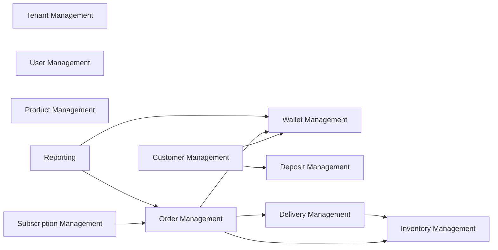

# Domain Design

Jalwala is organized into logical domain modules. Each domain owns its Services, Actions, DTOs, Events, Policies, and corresponding frontend `pages/` folder. Cross-domain integration happens through service calls or domain events — never direct model manipulation across domains.

---

## Tenant Management

**Responsibilities:** Supplier business profile, settings, branding (future), status (active/suspended), timezone, operating days.

**Entities:** `Tenant`

**Services:** `TenantService`, `TenantSettingsService`

**Events:** `TenantCreated`, `TenantSuspended`

---

## User Management

**Responsibilities:** Staff and customer authentication identities, role assignment, profile, 2FA/passkeys (existing Fortify).

**Entities:** `User` (extends current model with `tenant_id`, `phone`, `status`)

**Services:** `UserService`, `RoleAssignmentService`

**Events:** `UserCreated`, `UserDeactivated`

**Note:** Customer users link to `Customer` via `customers.user_id`.

---

## Customer Management

**Responsibilities:** Customer CRUD, addresses, onboarding, status lifecycle (prospect → active → paused → closed), link to user account.

**Entities:** `Customer`, `CustomerAddress`

**Services:** `CustomerService`, `CustomerOnboardingService`, `CustomerClosureService`

**Events:** `CustomerRegistered`, `CustomerActivated`, `CustomerPaused`, `CustomerClosed`

---

## Product Management

**Responsibilities:** Water products (jar sizes, bottles), pricing, deposit amount per product, active/inactive.

**Entities:** `Product`, `ProductPriceHistory` (optional audit)

**Services:** `ProductService`

**Events:** `ProductCreated`, `ProductPriceChanged`, `ProductDeactivated`

---

## Wallet Management

**Responsibilities:** Prepaid balance (can go negative), top-ups, order debits, refunds, manual adjustments, ledger.

**Entities:** `Wallet`, `WalletTransaction`

**Services:** `WalletService`, `WalletTopUpService`, `WalletAdjustmentService`

**Events:** `WalletCredited`, `WalletDebited`, `WalletBalanceBelowThreshold`

---

## Deposit Management

**Responsibilities:** Jar/container deposits at signup, deposit ledger, refunds on customer closure. **Separate from wallet.**

**Entities:** `CustomerDeposit`, `DepositTransaction`

**Services:** `DepositService`, `DepositRefundService`

**Events:** `DepositCollected`, `DepositRefunded`

---

## Subscription Management

**Responsibilities:** Recurring delivery schedules, multi-product/quantity, weekly day selection, vacation pause/resume, link to auto-generated orders.

**Entities:** `Subscription`, `SubscriptionItem`, `SubscriptionSchedule`, `SubscriptionPause`

**Services:** `SubscriptionService`, `SubscriptionPauseService`, `SubscriptionOrderGeneratorService`

**Events:** `SubscriptionCreated`, `SubscriptionPaused`, `SubscriptionResumed`, `SubscriptionCancelled`, `SubscriptionOrderGenerated`

---

## Order Management

**Responsibilities:** Manual and subscription orders, status machine, pricing, wallet deduction trigger, cancellation/refund.

**Entities:** `Order`, `OrderItem`, `OrderStatusHistory`

**Services:** `OrderService`, `ManualOrderService`, `OrderCancellationService`

**Events:** `OrderCreated`, `OrderConfirmed`, `OrderCancelled`, `OrderDelivered`

---

## Inventory Management

**Responsibilities:** Filled/empty jar tracking at warehouse and per customer, movements on delivery/return.

**Entities:** `InventoryLocation`, `InventoryBalance`, `InventoryMovement`

**Services:** `InventoryService`, `CustomerInventoryService`

**Events:** `InventoryAdjusted`, `JarsDelivered`, `JarsCollected`

---

## Delivery Management

**Responsibilities:** Agent assignment, route grouping (future), delivery execution, proof/status updates.

**Entities:** `Delivery`, `DeliveryAssignment`

**Services:** `DeliveryService`, `DeliveryAssignmentService`

**Events:** `DeliveryAssigned`, `DeliveryStarted`, `DeliveryCompleted`, `DeliveryFailed`

---

## Reporting

**Responsibilities:** Read-only aggregations, exports (CSV/PDF future), cached summaries.

**Entities:** None (query-only); optional `ReportCache` table

**Services:** `SalesReportService`, `ConsumptionReportService`, `WalletReportService`, `DepositReportService`, `OutstandingBalanceReportService`, `AgentPerformanceReportService`

**Events:** `ReportGenerated` (for audit)

---

## Domain Dependency Map

---

## Integration Rules

| From | To | Rule |
|------|-----|------|
| Order | Wallet | Call `WalletService::debit()` — never write wallet rows directly |
| Subscription | Order | Call `OrderService::createFromSubscription()` — never duplicate order logic |
| Delivery | Inventory | Triggered by `OrderDelivered` event — not inline in delivery controller |
| Customer | Wallet / Deposit | Created during onboarding via respective services |
| Reporting | All financial domains | Read-only queries via repositories; no mutations |
