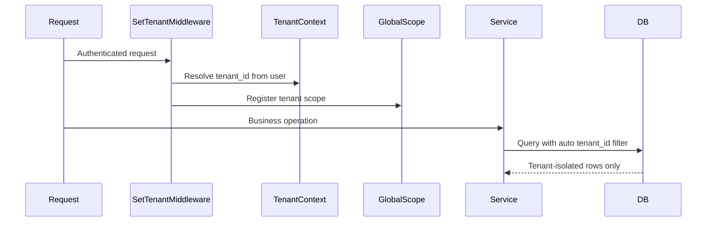

# Multi-Tenant Strategy

Jalwala uses a **single database, shared schema** approach with `tenant_id` column isolation. No tenancy package is used. Spatie Permission teams remain **disabled**.

---

## Architecture



---

## `tenant_id` Handling

| Context | tenant_id source |
|---------|-----------------|
| Supplier Admin / Delivery Agent | `auth()->user()->tenant_id` |
| Customer portal user | `auth()->user()->tenant_id` (same tenant as linked Customer) |
| Super Admin | Selects active tenant via session/UI context, or `tenant_id = null` for platform views |
| Queue jobs | Serialized `tenant_id` in job constructor; restored in `handle()` |
| Scheduler | Iterates `Tenant::active()` and sets context per tenant |
| Seeders/tests | Explicit `TenantContext::set($tenant)` |

---

## Data Isolation

1. **`BelongsToTenant` trait** on all tenant-scoped models:
   - Auto-fills `tenant_id` on `creating` from `TenantContext`
   - Applies `TenantScope` global scope filtering `where tenant_id = ?`
2. **`TenantScope`** skipped when `TenantContext::isBypassed()` (Super Admin cross-tenant reports only)
3. **Foreign keys** always include `tenant_id` in composite indexes where cross-tenant FK confusion is possible
4. **Policies** verify `$model->tenant_id === $user->tenant_id` even with global scope (defense in depth)

---

## Middleware Strategy

`EnsureTenantIsSet` (after `auth`):

- If user has `tenant_id` → set `TenantContext`
- If Super Admin → read `session('active_tenant_id')` or allow platform routes
- Abort 403 if tenant required but missing

### Route Groups

| Prefix | Audience | Phase |
|--------|----------|-------|
| `/admin/*` | Supplier Admin + permissions | 1+ |
| `/agent/*` | Delivery Agent (mobile-optimized) | 6+ |
| `/portal/*` | Customer role | 2+ |
| `/platform/*` | Super Admin only | 10 |

---

## Model Trait Strategy

```
App\Traits\BelongsToTenant     → scope + auto-fill
App\Traits\HasUuid             → public order reference
App\Support\TenantContext      → static holder (request/job scoped)
App\Scopes\TenantScope         → global scope implementation
```

**Never accept `tenant_id` from user input** on create/update — always from context.

---

## Queue & Scheduler Context

All queued jobs must:

1. Accept `tenant_id` in the constructor
2. Call `TenantContext::set($tenantId)` at the start of `handle()`
3. Use `after_commit = true` for financial jobs

The scheduler iterates active tenants and dispatches per-tenant jobs (e.g. subscription order generation) with tenant context restored in each worker.

---

## Super Admin Bypass

Users with `tenant_id = null` and the `super-admin` role:

- Skip `TenantScope` when `TenantContext::isBypassed()` is true
- Still require explicit Spatie permissions for destructive platform actions
- Select active tenant via `session('active_tenant_id')` for tenant-scoped operations during support/impersonation (Phase 10)

---

## SaaS Readiness

The current architecture supports future SaaS conversion without structural changes:

- `tenants` table already holds settings, status, timezone, currency
- Platform routes (`/platform/*`) reserved for Phase 10
- Tenant onboarding UI and billing hooks are additive — no database split required
