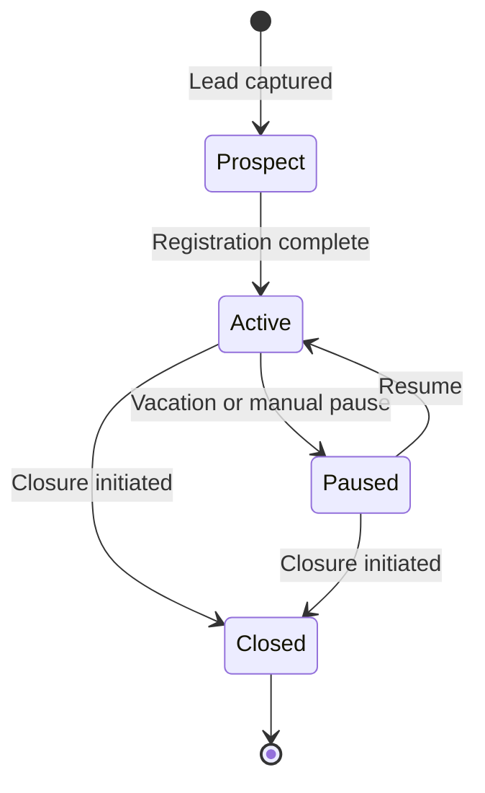
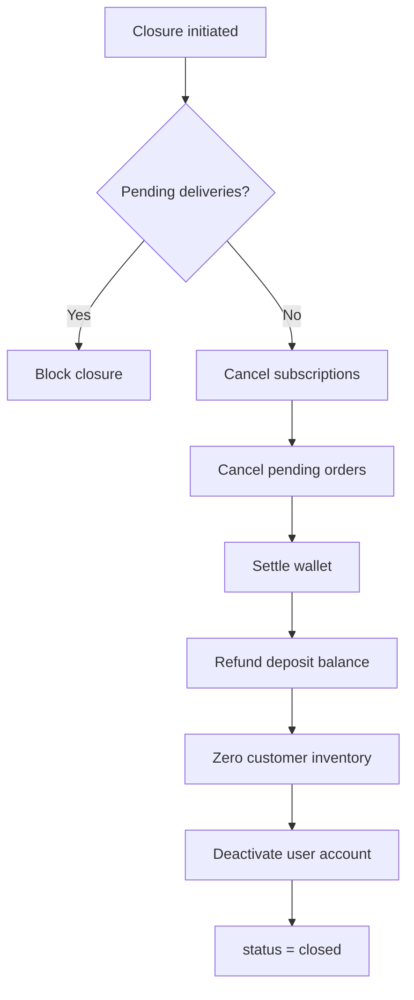

# Customer Journey

This document describes the customer lifecycle from lead capture through closure, including wallet, deposit, and subscription interactions.

---

## Status Lifecycle

| Status | Description |
|--------|-------------|
| `prospect` | Lead captured, onboarding not complete |
| `active` | Fully onboarded, receiving deliveries |
| `paused` | Account-wide pause (optional; subscription may be paused independently) |
| `closed` | Account terminated, deposits refunded, user deactivated |

---

## 1. Registration (Prospect → Active)

- Supplier Admin or self-registration (portal) creates Customer record
- Address captured with default delivery location
- Optional: Customer user account created (email + password, Customer role)
- **Deposit collected** at signup: `DepositService::collect()` for each returnable product (jar count × deposit_amount)
- **Wallet** created with optional opening balance / top-up
- **Inventory location** created for customer (empty jars = 0, filled = 0)
- Event: `CustomerRegistered`

### Onboarding Checklist

| Step | Service | Result |
|------|---------|--------|
| Create customer record | `CustomerOnboardingService` | `customers.status = active` |
| Capture address | `CustomerService` | Default `customer_addresses` row |
| Link portal user | `UserService` | `customers.user_id` set, Customer role assigned |
| Collect deposits | `DepositService` | `customer_deposits.balance` increased |
| Create wallet | `WalletService` | Optional `opening_balance` credit |
| Create inventory location | `InventoryService` | Customer location with zero balances |

---

## 2. Active Operations

- Manual orders via admin or customer portal
- Subscription setup with weekly delivery days
- Wallet top-ups (cash/UPI recorded by admin; future payment gateway)
- Low balance notifications
- Customer views ledger, upcoming deliveries

---

## 3. Vacation Pause

- Customer or admin pauses subscription via `SubscriptionPauseService`
- Date range stored in `subscription_pauses`; `subscriptions.status = paused`
- Scheduler skips order generation for paused dates
- Customer status may remain `active` (only subscription paused) or `paused` (account-wide)

---

## 4. Wallet Usage

- Orders debit wallet on confirmation (or delivery — configurable per tenant setting)
- Balance can go **negative** (credit line model); alerts sent at threshold
- Refunds credit wallet on order cancellation

See [08-wallet-architecture.md](./08-wallet-architecture.md) for ledger details.

---

## 5. Deposits During Lifecycle

- Deposits **not** touched per order — only at signup, jar count changes, or closure
- Additional jars → new deposit collection
- Jar returns → deposit refund partials (if policy allows mid-lifecycle)

See [09-deposit-architecture.md](./09-deposit-architecture.md) for deposit workflow.

---

## 6. Customer Closure

### Preconditions

- No pending deliveries
- Subscription cancelled

### Closure Orchestration

`CustomerClosureService` orchestrates:

1. Cancel active subscriptions
2. Cancel pending orders (or complete in-flight)
3. Settle wallet (optional final debit/credit)
4. **Refund remaining deposit** via `DepositRefundService`
5. Zero out customer inventory (collect all jars)
6. Deactivate customer user account
7. Set `customers.status = closed`, `closed_at = now()`

Event: `CustomerClosed`

