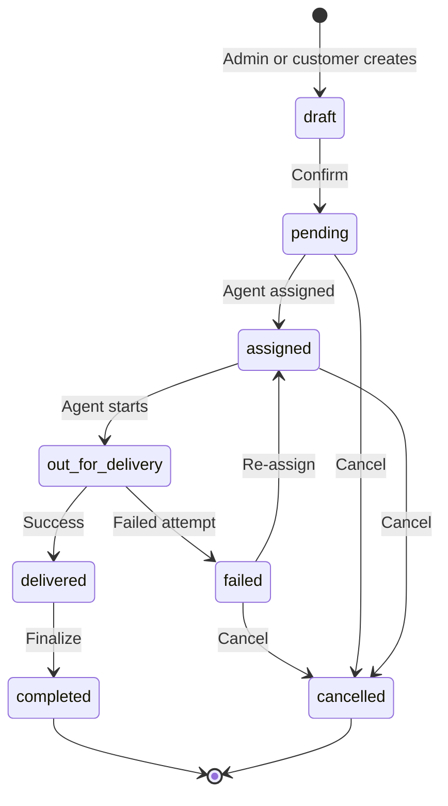

# Order Lifecycle

Orders are the central transactional unit connecting customers, wallet, inventory, and delivery. This document defines status transitions, manual vs subscription flows, and wallet integration.

---

## Status Definitions

| Status | Description |
|--------|-------------|
| `draft` | Being composed, not confirmed |
| `pending` | Confirmed, awaiting assignment |
| `assigned` | Delivery agent assigned |
| `out_for_delivery` | Agent en route |
| `delivered` | Successfully delivered |
| `failed` | Delivery attempt failed |
| `cancelled` | Cancelled before delivery |
| `completed` | Post-delivery finalization (wallet settled, inventory updated) |

---

## Manual Order Flow

### Step-by-Step

1. **Create:** `ManualOrderService` validates products, address, scheduled_date
2. **Confirm:** Status → `pending`; triggers wallet hold/debit per tenant policy
3. **Assign:** `DeliveryAssignmentService` picks agent → `assigned`
4. **Deliver:** Agent marks `out_for_delivery` → `delivered` with timestamp
5. **Complete:** Listener updates inventory, finalizes wallet, status → `completed`

### Order Sources

| Source | Created By | Notes |
|--------|------------|-------|
| `manual` | Supplier Admin | Admin UI order creation |
| `subscription` | Scheduler | Auto-generated nightly |
| `customer_portal` | Customer | Self-service portal |

---

## Subscription Order Flow

1. `SubscriptionOrderGeneratorService` runs nightly per tenant
2. For each active subscription, check if `scheduled_date` matches `subscription_schedules.day_of_week`
3. Skip if date falls within `subscription_pauses` range
4. Create order with `source = subscription`, `status = pending` (auto-confirmed)
5. Same assignment → delivery flow as manual
6. Idempotency: unique constraint on `(subscription_id, scheduled_date)` prevents duplicates

See [10-subscription-engine.md](./10-subscription-engine.md) for scheduler details.

---

## Wallet Deduction Process

**Recommended default:** Debit on **confirmation** (pending), reverse on cancellation.

1. `OrderService::confirm()` calls `WalletService::debit(amount, order, idempotency_key)`
2. `WalletService` creates `wallet_transactions` row, updates cached `wallets.balance`
3. Negative balance allowed — no exception thrown (optional warning notification)
4. On cancellation: `WalletService::credit()` with `category = refund`

### Tenant-Configurable Policy

| Setting | Behavior |
|---------|----------|
| Debit on confirm (default) | Wallet charged when order moves to `pending` |
| Debit on delivery | Wallet charged when order moves to `delivered` |

Stored in `tenants.settings` JSON.

---

## Assignment Process

- Supplier Admin assigns from pending orders list (mobile: swipe to assign)
- Auto-assignment (future): by zone/agent capacity
- Agent sees only own assignments via policy scope

### Delivery Status Mapping

| Order Status | Delivery Status |
|--------------|-----------------|
| `assigned` | `assigned` |
| `out_for_delivery` | `in_progress` |
| `delivered` | `completed` |
| `failed` | `failed` |

---

## Cancellation Rules

| Current Status | Who Can Cancel | Wallet Action |
|----------------|----------------|---------------|
| `draft` | Admin, Customer | None |
| `pending` | Admin, Customer | Refund if debited |
| `assigned` | Admin | Refund if debited |
| `out_for_delivery` | Admin only | Refund if debited |
| `delivered` | — | Cannot cancel |
| `completed` | — | Cannot cancel |

---

## Status History

Every status transition is recorded in `order_status_histories`:

- `from_status`, `to_status`
- `changed_by` (user_id)
- `notes` (optional reason)
- `created_at`

This provides a full audit trail for disputes and reporting.
