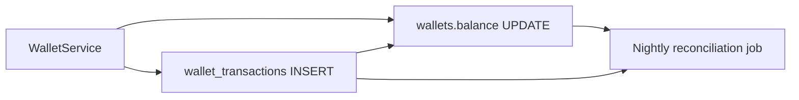

# Wallet Architecture

The wallet system manages prepaid consumption credit for customers. It is **separate from deposits** (jar/container liability). Balances can go negative (credit line model).

---

## Ledger Strategy

- **Append-only** `wallet_transactions` — source of truth
- `wallets.balance` is a **cached denormalized value** updated atomically in same DB transaction as ledger insert
- Balance verification job (nightly) reconciles `balance` vs `SUM(transactions)`

---

## Data Model

| Table | Purpose |
|-------|---------|
| `wallets` | One per customer; cached `balance`, optional `low_balance_threshold` |
| `wallet_transactions` | Append-only ledger with `balance_after` snapshot |

See [03-database-design.md](./03-database-design.md) for column definitions.

---

## Transaction Categories

| Category | Type | Trigger |
|----------|------|---------|
| `opening_balance` | credit | Customer onboarding |
| `top_up` | credit | Admin records payment |
| `order_payment` | debit | Order confirmed/delivered |
| `refund` | credit | Order cancelled |
| `adjustment` | credit/debit | Admin correction with reason |

### Transaction Fields

Every ledger row includes:

- `type` — `credit` or `debit` (amount always positive)
- `category` — business reason
- `amount` — always positive decimal
- `balance_after` — snapshot after transaction
- `reference_type` / `reference_id` — polymorphic-lite link to order, etc.
- `idempotency_key` — UNIQUE, prevents duplicate charges from retries
- `created_by` — user who initiated
- `created_at` — no `updated_at` (append-only)

---

## Balance Calculation

| Context | Method |
|---------|--------|
| **Runtime** | Read `wallets.balance` (fast) |
| **Audit/reports** | `SUM(credits) - SUM(debits)` from ledger |
| **Negative balance** | Allowed; `low_balance_threshold` triggers `LowWalletBalanceNotification` |

---

## Service API (Conceptual)

| Method | Description |
|--------|-------------|
| `WalletService::credit()` | Add funds with category and idempotency key |
| `WalletService::debit()` | Deduct funds; allows negative balance |
| `WalletTopUpService::topUp()` | Admin-recorded payment (cash/UPI) |
| `WalletAdjustmentService::adjust()` | Manual correction with mandatory reason |

All methods run inside `DB::transaction()` with `after_commit = true` on queued side effects.

---

## Audit Strategy

- Every transaction stores `created_by`, `reference_type/id`, `idempotency_key`
- No UPDATE/DELETE on ledger rows
- Corrections = new `adjustment` transaction with description
- Admin adjustment requires `wallet.adjust` permission + mandatory reason field

---

## Integration Points

| Domain | Integration |
|--------|-------------|
| Order | `OrderService::confirm()` debits wallet; cancellation credits refund |
| Customer onboarding | Optional `opening_balance` credit |
| Reporting | `WalletReportService` aggregates ledger data |
| Notifications | `WalletBalanceBelowThreshold` event → `LowWalletBalanceNotification` |

---

## Idempotency

Critical for financial integrity:

- Every debit/credit requires a unique `idempotency_key`
- Order debits use key format: `order-{order_id}-payment`
- Retries (queue, network) safely no-op on duplicate key
- Database UNIQUE constraint on `idempotency_key` is the final guard

---

## Reconciliation Job

Nightly per tenant:

1. For each wallet, compute `SUM(credits) - SUM(debits)` from ledger
2. Compare to `wallets.balance`
3. Log discrepancies for admin review
4. Optional: auto-correct with `adjustment` transaction (admin approval required)
