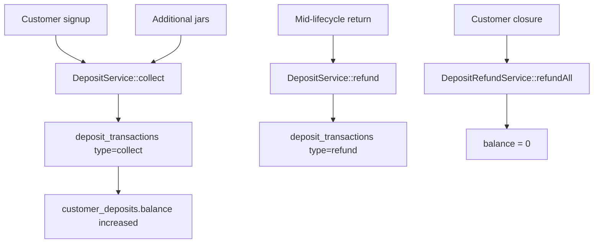

# Deposit Architecture

Deposits represent **physical jar liability** — money held for returnable containers. This is intentionally **separate from the wallet**, which represents prepaid consumption credit.

**Never deduct deposits for order payments.**

---

## Separation from Wallet

| Concept | Represents | Table |
|---------|------------|-------|
| Wallet | Prepaid consumption credit | `wallets`, `wallet_transactions` |
| Deposit | Jar/container liability | `customer_deposits`, `deposit_transactions` |

Orders track filled jars delivered and empty jars collected via **inventory**, not the deposit table.

---

## Data Model

| Table | Purpose |
|-------|---------|
| `customer_deposits` | One per customer; cached `balance` of held deposits |
| `deposit_transactions` | Append-only ledger with `jar_count`, `product_id`, `balance_after` |

See [03-database-design.md](./03-database-design.md) for column definitions.

---

## Workflow

### Signup

1. Admin specifies jar count per product
2. `DepositService::collect(customer, product, qty, amount)`
3. `deposit_transactions.type = collect`; `customer_deposits.balance` increased

### During Lifecycle

- Deposits change only when jar count changes (customer gets 2 more jars → additional collect)
- Orders track **filled jars delivered** and **empty jars collected** via inventory, not deposit table

### Jar Return (Mid-Lifecycle, Optional)

- Admin processes partial refund: `DepositService::refund(customer, amount, jar_count)`
- Policy-dependent: some tenants only refund on closure

### Customer Closure

1. Count empty jars collected from customer
2. `DepositRefundService::refundAll()` — full remaining `customer_deposits.balance`
3. `deposit_transactions.type = refund`
4. Balance → 0

---

## Transaction Types

| Type | Description |
|------|-------------|
| `collect` | Deposit taken for jars issued to customer |
| `refund` | Deposit returned (partial or full) |
| `adjustment` | Admin correction with reason |

---

## Audit

- Append-only `deposit_transactions` with `balance_after` snapshot
- Linked to `product_id` and `jar_count` for traceability
- Every transaction stores `created_by` and optional `reference_type/id`
- No UPDATE/DELETE on ledger rows
- Corrections via new `adjustment` transaction

---

## Service API (Conceptual)

| Method | Description |
|--------|-------------|
| `DepositService::collect()` | Record deposit collection at signup or jar increase |
| `DepositService::refund()` | Partial refund for returned jars |
| `DepositRefundService::refundAll()` | Full refund on customer closure |

All methods run inside `DB::transaction()`.

---

## Integration Points

| Domain | Integration |
|--------|-------------|
| Customer onboarding | Deposit collected per returnable product |
| Customer closure | Full deposit refund via `CustomerClosureService` |
| Inventory | Jar counts tracked separately; deposit reflects financial liability |
| Reporting | `DepositReportService` aggregates held deposits, collections, refunds |

---

## Permissions

| Permission | Who |
|------------|-----|
| `deposits.view` | Admin; customer sees own (read-only) |
| `deposits.collect` | Supplier Admin |
| `deposits.refund` | Supplier Admin |
| `deposits.adjust` | Supplier Admin |
| `deposits.view-ledger` | Supplier Admin |
