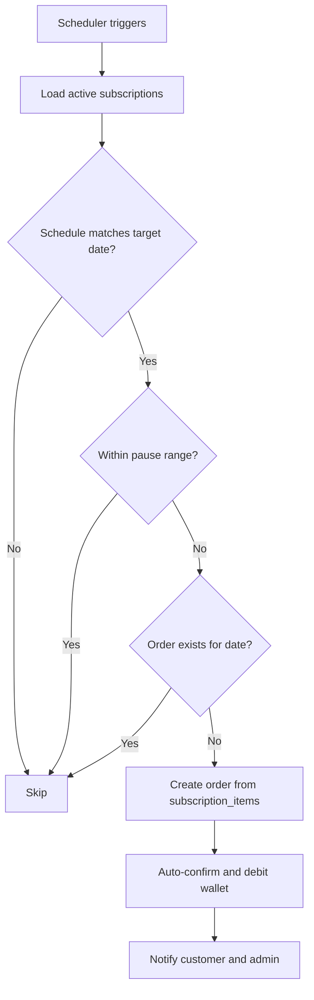
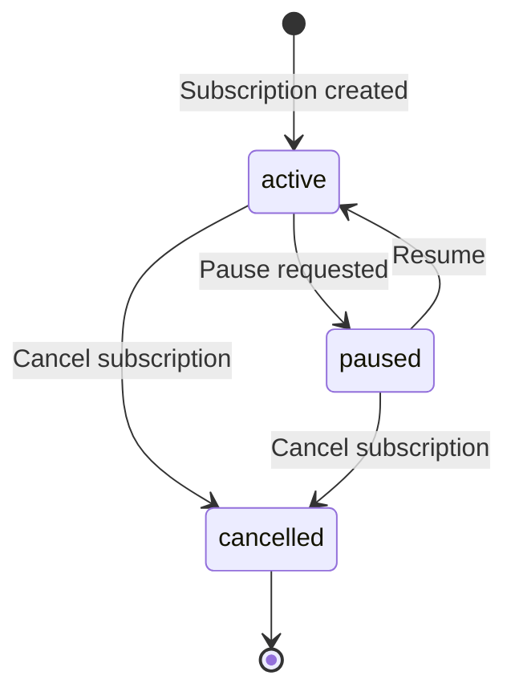

# Subscription Engine

The subscription engine automates recurring order generation based on weekly schedules, with support for vacation pauses and multi-product subscriptions.

---

## Entities

| Entity | Purpose |
|--------|---------|
| `Subscription` | Customer recurring delivery plan |
| `SubscriptionItem` | Product + quantity + price snapshot |
| `SubscriptionSchedule` | Day-of-week delivery days (0=Sun … 6=Sat) |
| `SubscriptionPause` | Vacation date ranges |

---

## Scheduler Design

```
Daily 02:00 tenant timezone:
  SubscriptionOrderGenerationJob(tenant_id)
    → SubscriptionOrderGeneratorService::generateForDate(tomorrow)
```

- Per-tenant timezone from `tenants.timezone`
- Configurable lead time: generate orders N days ahead (tenant setting, default 1)
- Queue: `subscriptions` (Redis)
- Job restores `TenantContext` from serialized `tenant_id`

---

## Generation Process



### Generation Rules

1. Load all `subscriptions` where `status = active`
2. For each subscription, check if target date's day-of-week exists in `subscription_schedules`
3. Skip if target date falls within any `subscription_pauses` range (`start_date` ≤ date ≤ `end_date`)
4. Skip if order already exists for `(subscription_id, scheduled_date)` — idempotency
5. Create order from `subscription_items` with price snapshots
6. Set `source = subscription`, auto-confirm to `pending`
7. Debit wallet per tenant policy
8. Emit `SubscriptionOrderGenerated` event
9. Notify customer and admin

---

## Pause/Resume Process

### Pause

- Create `subscription_pauses` row with `start_date` and `end_date`
- Set `subscriptions.status = paused` if indefinite (no end date)
- Customer portal: pick date range (vacation mode) — mobile date picker UI
- Paused dates do not generate orders; no retroactive generation on resume

### Resume

- Set `end_date` on pause row or delete future pause
- Set `subscriptions.status = active`
- Orders resume generating on next matching schedule day



---

## Services

| Service | Responsibility |
|---------|----------------|
| `SubscriptionService` | CRUD, status management |
| `SubscriptionPauseService` | Pause/resume with date ranges |
| `SubscriptionOrderGeneratorService` | Nightly order generation logic |

---

## Events

| Event | When |
|-------|------|
| `SubscriptionCreated` | New subscription activated |
| `SubscriptionPaused` | Pause applied |
| `SubscriptionResumed` | Pause ended |
| `SubscriptionCancelled` | Subscription terminated |
| `SubscriptionOrderGenerated` | Order auto-created from subscription |

---

## Integration Points

| Domain | Integration |
|--------|-------------|
| Order | `OrderService::createFromSubscription()` — never duplicate order logic |
| Wallet | Auto-debit on order confirmation |
| Customer | Portal UI for pause/resume, upcoming deliveries preview |
| Notifications | `SubscriptionPausedNotification`, order generation alerts |

---

## UI Considerations (Mobile-First)

- Day-of-week toggle chips for schedule selection
- Pause calendar with date range picker
- Upcoming deliveries preview on portal subscription page
- Admin: subscription list with status badges, quick pause action

---

## Idempotency

Unique constraint on `(subscription_id, scheduled_date)` on orders table prevents duplicate generation from scheduler retries or overlapping job runs.
