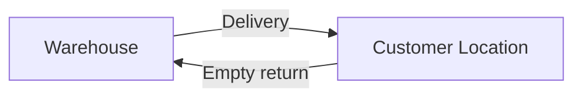

# Inventory Design

Inventory tracks filled and empty jars at the warehouse and at each customer premises. Movements are driven by delivery events and manual adjustments.

---

## Tracking Model

- **Warehouse location** (`locatable_type = tenant_warehouse`) — supplier stock
- **Customer location** (`locatable_type = customer`) — jars at customer premises

Per product at each location:

- `filled_quantity` — full jars ready to consume
- `empty_quantity` — empty containers awaiting pickup

---

## Entities

| Entity | Purpose |
|--------|---------|
| `InventoryLocation` | Warehouse or customer storage point |
| `InventoryBalance` | Current filled/empty counts per product per location |
| `InventoryMovement` | Append-only log of all stock changes |

See [03-database-design.md](./03-database-design.md) for column definitions.

---

## Inventory Movement

| Event | Warehouse | Customer |
|-------|-----------|----------|
| Stock received | filled +N | — |
| Delivery completed | filled -N | filled +N |
| Empty collected on delivery | empty +N | empty -N |
| New customer jars | filled -N (if from warehouse) | filled +N |
| Customer closure | empty +N (all collected) | filled/empty → 0 |

---

## Delivery Impact

`OrderDelivered` listener calls `InventoryService::transfer()`:

- Warehouse `filled_quantity` decreases
- Customer `filled_quantity` increases
- If empties collected: customer `empty_quantity` decreases, warehouse `empty_quantity` increases

This is **event-driven** — not inline in the delivery controller.

---

## Movement Types

| Type | Description |
|------|-------------|
| `filled_in` | Filled jars added to location |
| `filled_out` | Filled jars removed from location |
| `empty_in` | Empty jars added to location |
| `empty_out` | Empty jars removed from location |
| `adjustment` | Manual correction with reason |

Every movement records:

- `inventory_location_id`, `product_id`
- `movement_type`, `quantity`
- `reference_type/id` (order, manual)
- `created_by`, `created_at`

---

## Customer Inventory Tracking

- Customer portal shows: "You have 3 filled jars, 1 empty jar at premises"
- Admin view per customer for reconciliation
- Created automatically during customer onboarding (zero balances)

---

## Services

| Service | Responsibility |
|---------|----------------|
| `InventoryService` | Warehouse stock, transfers, movements |
| `CustomerInventoryService` | Per-customer jar view and reconciliation |

---

## Events

| Event | When |
|-------|------|
| `InventoryAdjusted` | Manual adjustment recorded |
| `JarsDelivered` | Filled jars delivered to customer |
| `JarsCollected` | Empty jars collected from customer |

---

## Relationship to Deposits

| System | Tracks |
|--------|--------|
| Inventory | Physical jar counts (filled/empty) |
| Deposits | Financial liability for returnable containers |

Jar delivery and collection update inventory. Deposit balances change only at signup, jar count changes, or closure — not per order.

---

## Permissions

| Permission | Who |
|------------|-----|
| `inventory.view` | Supplier Admin |
| `inventory.adjust` | Supplier Admin |
| `inventory.view-customer` | Supplier Admin, Delivery Agent (view) |

---

## UI Considerations

- Stock dashboard for warehouse (admin)
- Customer jar view per customer record
- Quick adjust form for manual corrections
- Mobile-friendly counts on delivery agent app (future)
