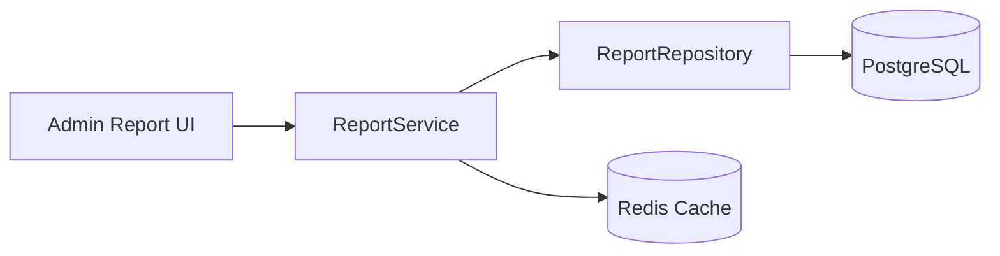

# Reporting Module

The reporting module provides read-only aggregations and exports. Reports query across domain tables via repositories — no mutations.

---

## Architecture

**Implementation:** `ReportRepository` with raw SQL/Query Builder; results cached in Redis (15 min TTL) keyed by `tenant_id + report + filters hash`.

---

## Report Types

### Sales Report

- **Filters:** date range, product, customer, source (manual/subscription)
- **Metrics:** total revenue, order count, avg order value, revenue by product
- **Grain:** daily/weekly/monthly
- **Export:** CSV
- **Service:** `SalesReportService`

### Consumption Report

- **Metrics:** liters/units delivered per customer, per product, per period
- **Use case:** Identify high/low consumption customers
- **Service:** `ConsumptionReportService`

### Wallet Report

- **Metrics:** total top-ups, debits, adjustments, negative balance accounts
- **Detail:** transaction ledger with customer breakdown
- **Service:** `WalletReportService`

### Deposits Report

- **Metrics:** total deposits held, collections, refunds, by product
- **Detail:** customers with outstanding jar deposits
- **Service:** `DepositReportService`

### Outstanding Balances Report

- **Metrics:** customers with negative wallet balance, amount owed, aging (30/60/90 days)
- **Action list:** for collection follow-up
- **Service:** `OutstandingBalanceReportService`

### Delivery Agent Performance Report

- **Filters:** date range, agent
- **Metrics:** deliveries completed, failed, avg delivery time, orders per day
- **Comparison:** agent leaderboard
- **Service:** `AgentPerformanceReportService`

---

## Report Summary Table

| Report | Key Filters | Primary Metrics | Export |
|--------|-------------|-----------------|--------|
| Sales | Date, product, customer, source | Revenue, order count, AOV | CSV |
| Consumption | Date, product, customer | Units/liters delivered | CSV |
| Wallet | Date, customer | Top-ups, debits, adjustments | CSV |
| Deposits | Date, product | Held, collected, refunded | CSV |
| Outstanding | Aging buckets | Negative balances, amounts owed | CSV |
| Agent Performance | Date, agent | Completed, failed, avg time | CSV |

---

## Caching Strategy

| Aspect | Detail |
|--------|--------|
| Store | Redis (optional `report_caches` table for persistence) |
| TTL | 15 minutes |
| Key format | `{tenant_id}:{report_type}:{filters_hash}` |
| Invalidation | On financial mutations (wallet, order) — listener clears relevant cache keys |
| Queue | Heavy pre-computation on `reports` queue |

---

## Repository Pattern

Reports use `ReportRepository` (Phase 9+) for:

- Complex reporting queries with dynamic filters
- Raw aggregations (sales by period, agent KPIs)
- Reusable query builders shared across reports

All other domains use Eloquent directly in services.

---

## Permissions

| Permission | Report |
|------------|--------|
| `reports.sales` | Sales Report |
| `reports.consumption` | Consumption Report |
| `reports.wallet` | Wallet Report |
| `reports.deposits` | Deposits Report |
| `reports.outstanding` | Outstanding Balances Report |
| `reports.agent-performance` | Agent Performance Report |

Only Supplier Admin and Super Admin have report permissions.

---

## UI Considerations (Mobile-First)

- Report picker (card grid)
- Filter bottom sheet (mobile)
- Summary cards + detail table
- Deferred props with skeleton loaders for heavy data
- CSV export button

---

## Events

| Event | When |
|-------|------|
| `ReportGenerated` | Audit log when report is generated/exported |
