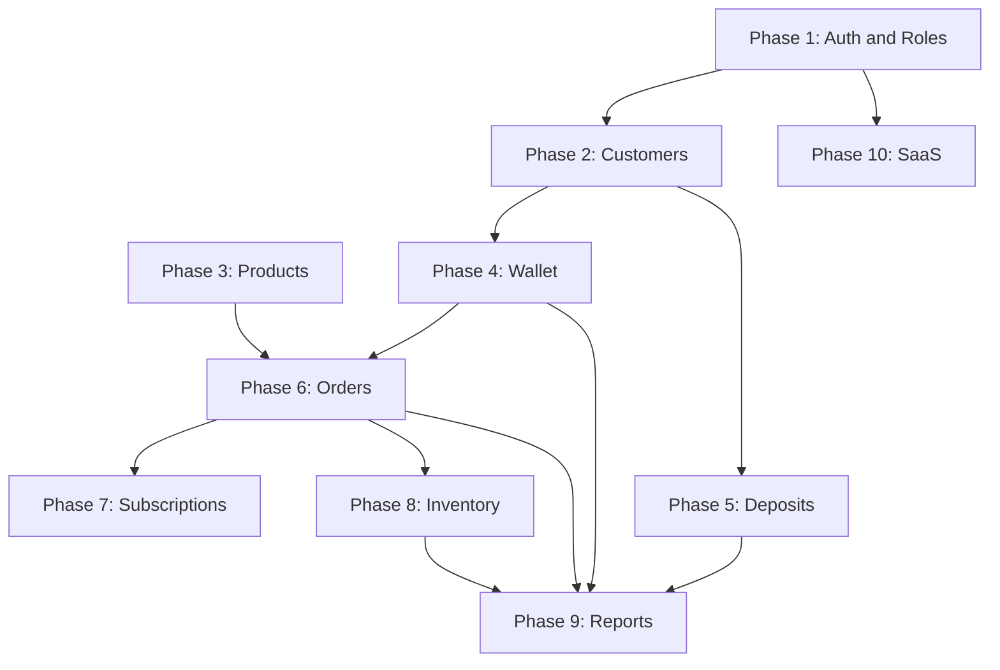

# Development Roadmap

Phased implementation plan for Jalwala. Each phase builds on the previous with Pest tests, Pint formatting, tenant scoping tests, and policy tests as cross-cutting requirements.

**Cross-cutting (all phases):** Mobile-first responsive UI, Pest tests per feature, Pint formatting, tenant scoping tests, policy tests.

---

## Phase 1: Authentication & Roles

- **Features:** Tenant model, extend User with `tenant_id`, roles/permissions seeder, `EnsureTenantIsSet` middleware, `TenantContext`, role-based route groups, admin user management UI
- **Database:** `tenants`, alter `users`, seed Spatie roles/permissions
- **API/Routes:** `/admin/users`, role assignment endpoints
- **UI:** Admin users list/create (mobile table cards), role badges, extend existing auth pages

---

## Phase 2: Customers

- **Features:** Customer CRUD, addresses, onboarding flow, customer portal registration, customer status management
- **Database:** `customers`, `customer_addresses`
- **Routes:** `/admin/customers/*`, `/portal/profile`
- **UI:** Customer list with search, mobile-friendly form wizard for onboarding, address picker

---

## Phase 3: Products

- **Features:** Product catalog, pricing, deposit amounts, activate/deactivate
- **Database:** `products`
- **Routes:** `/admin/products/*`
- **UI:** Product cards grid, quick price edit

---

## Phase 4: Wallet

- **Features:** Wallet creation on customer onboard, top-up, adjustment, ledger view, low balance alerts, negative balance support
- **Database:** `wallets`, `wallet_transactions`
- **Routes:** `/admin/customers/{id}/wallet`, `/portal/wallet`
- **UI:** Balance card (prominent), transaction list (infinite scroll), top-up modal

---

## Phase 5: Deposits

- **Features:** Deposit collection at signup, ledger, mid-lifecycle adjustments, refund preview on closure
- **Database:** `customer_deposits`, `deposit_transactions`
- **Routes:** `/admin/customers/{id}/deposits`, `/portal/deposits` (read-only)
- **UI:** Deposit summary card, jar count indicator

---

## Phase 6: Orders

- **Features:** Manual order creation, status machine, confirmation, cancellation, wallet debit integration, order history
- **Database:** `orders`, `order_items`, `order_status_histories`
- **Routes:** `/admin/orders/*`, `/portal/orders/*`
- **UI:** Order creation stepper (product picker → date → confirm), status timeline, swipe actions for admin

---

## Phase 7: Subscriptions

- **Features:** Subscription CRUD, multi-product items, weekly schedule, vacation pause/resume, auto order generation command/job
- **Database:** `subscriptions`, `subscription_items`, `subscription_schedules`, `subscription_pauses`
- **Routes:** `/admin/subscriptions/*`, `/portal/subscription`
- **UI:** Day-of-week toggle chips (mobile), pause calendar, upcoming deliveries preview

---

## Phase 8: Inventory

- **Features:** Warehouse stock, customer jar tracking, movements on delivery, manual adjustments
- **Database:** `inventory_locations`, `inventory_balances`, `inventory_movements`
- **Routes:** `/admin/inventory/*`
- **UI:** Stock dashboard, customer jar view, quick adjust form

---

## Phase 9: Reports

- **Features:** All 6 report types, date filters, CSV export, cached queries
- **Database:** Optional `report_caches` or Redis only
- **Routes:** `/admin/reports/*`
- **UI:** Report picker, filter bottom sheet (mobile), summary cards + detail table

---

## Phase 10: SaaS Conversion

- **Features:** Tenant self-registration, platform Super Admin dashboard, tenant suspension, per-tenant settings/branding, billing hooks (stub), custom domain prep (config only), onboarding wizard for new suppliers
- **Database:** Extend `tenants.settings`, `tenant_subscriptions` (future billing)
- **Routes:** `/platform/*`
- **UI:** Tenant list, impersonation mode for support, tenant onboarding flow

---

## Phase Dependency Map

---

## Phase Summary Table

| Phase | Domain | Key Deliverables |
|-------|--------|------------------|
| 1 | Auth & Roles | Tenant, roles, middleware, user management |
| 2 | Customers | CRUD, addresses, onboarding, portal registration |
| 3 | Products | Catalog, pricing, deposits per product |
| 4 | Wallet | Ledger, top-up, adjustments, negative balance |
| 5 | Deposits | Collection, refund, closure settlement |
| 6 | Orders | Status machine, wallet debit, delivery assignment |
| 7 | Subscriptions | Schedule, pause, auto order generation |
| 8 | Inventory | Warehouse + customer jar tracking |
| 9 | Reports | 6 report types, CSV export, caching |
| 10 | SaaS | Multi-tenant onboarding, platform admin |
