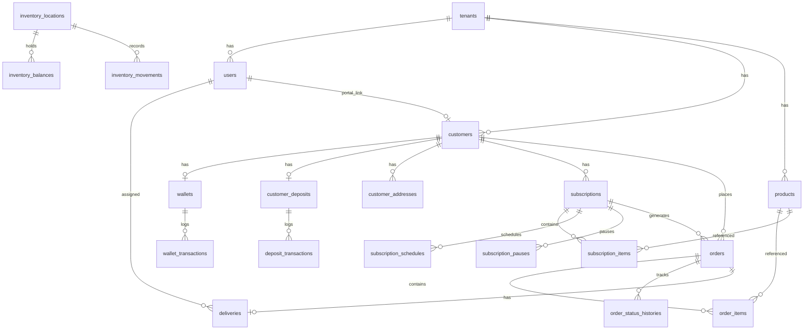

# Entity-Relationship Diagram

Full ERD for the Jalwala database schema. See [03-database-design.md](./03-database-design.md) for detailed column definitions.

---

## Relationship Diagram



---

## Entity Overview

### Platform & Identity

| Entity | PK | Key Relationships |
|--------|-----|-----------------|
| `tenants` | bigint | Parent of all tenant-scoped data |
| `users` | bigint | belongs to `tenants` (nullable for Super Admin) |

### Customer Domain

| Entity | PK | Key Relationships |
|--------|-----|-----------------|
| `customers` | bigint | belongs to `tenants`; optional `users` portal link |
| `customer_addresses` | bigint | belongs to `customers` |

### Financial Domain

| Entity | PK | Key Relationships |
|--------|-----|-----------------|
| `wallets` | bigint | 1:1 with `customers` |
| `wallet_transactions` | bigint | belongs to `wallets` (append-only) |
| `customer_deposits` | bigint | 1:1 with `customers` |
| `deposit_transactions` | bigint | belongs to `customer_deposits` (append-only) |

### Product Domain

| Entity | PK | Key Relationships |
|--------|-----|-----------------|
| `products` | bigint | belongs to `tenants` |

### Subscription Domain

| Entity | PK | Key Relationships |
|--------|-----|-----------------|
| `subscriptions` | bigint | belongs to `customers`, `customer_addresses` |
| `subscription_items` | bigint | belongs to `subscriptions`, `products` |
| `subscription_schedules` | bigint | belongs to `subscriptions` |
| `subscription_pauses` | bigint | belongs to `subscriptions` |

### Order Domain

| Entity | PK | Key Relationships |
|--------|-----|-----------------|
| `orders` | bigint + uuid | belongs to `customers`; optional `subscriptions` |
| `order_items` | bigint | belongs to `orders`, `products` |
| `order_status_histories` | bigint | belongs to `orders` |
| `deliveries` | bigint | 1:1 with `orders`; assigned to `users` |

### Inventory Domain

| Entity | PK | Key Relationships |
|--------|-----|-----------------|
| `inventory_locations` | bigint | polymorphic: warehouse or customer |
| `inventory_balances` | bigint | belongs to `inventory_locations`, `products` |
| `inventory_movements` | bigint | belongs to `inventory_locations`, `products` |

---

## Cardinality Notes

| Relationship | Cardinality | Notes |
|--------------|-------------|-------|
| tenants → users | 1:N | Super Admin has `tenant_id = null` |
| customers → wallets | 1:1 | One wallet per customer |
| customers → customer_deposits | 1:1 | One deposit account per customer |
| customers → users | N:1 | Optional portal login link |
| orders → deliveries | 1:1 | One delivery per order |
| subscriptions → orders | 1:N | Auto-generated recurring orders |
| inventory_locations → inventory_balances | 1:N | Per product at each location |

---

## Spatie Permission Tables

Not shown in ERD (global, no `team_id`):

- `roles`
- `permissions`
- `model_has_roles`
- `model_has_permissions`
- `role_has_permissions`

---

## Design Constraints

- **tenant_id** required on all tenant-scoped tables, indexed
- **Financial tables** are append-only (no UPDATE/DELETE)
- **Money** stored as `decimal(12,2)`, never float
- **Soft deletes** on `customers`, `products`, `users` only
- **Public references** via `orders.uuid` for external sharing
- **Idempotency** via `wallet_transactions.idempotency_key` UNIQUE

---

## Detailed Entity Diagram

```mermaid
erDiagram
    tenants {
        bigint id PK
        varchar name
        varchar slug UK
        varchar timezone
        char currency
        jsonb settings
        enum status
    }

    users {
        bigint id PK
        bigint tenant_id FK
        varchar name
        varchar email
        varchar phone
        enum status
    }

    customers {
        bigint id PK
        bigint tenant_id FK
        bigint user_id FK
        varchar code
        varchar name
        enum status
    }

    customer_addresses {
        bigint id PK
        bigint tenant_id FK
        bigint customer_id FK
        varchar label
        boolean is_default
    }

    products {
        bigint id PK
        bigint tenant_id FK
        varchar name
        varchar sku
        enum type
        decimal unit_price
        decimal deposit_amount
        enum status
    }

    wallets {
        bigint id PK
        bigint tenant_id FK
        bigint customer_id FK UK
        decimal balance
    }

    wallet_transactions {
        bigint id PK
        bigint tenant_id FK
        bigint wallet_id FK
        enum type
        enum category
        decimal amount
        decimal balance_after
        varchar idempotency_key UK
    }

    customer_deposits {
        bigint id PK
        bigint tenant_id FK
        bigint customer_id FK UK
        decimal balance
    }

    deposit_transactions {
        bigint id PK
        bigint tenant_id FK
        bigint customer_deposit_id FK
        enum type
        decimal amount
        integer jar_count
    }

    subscriptions {
        bigint id PK
        bigint tenant_id FK
        bigint customer_id FK
        bigint customer_address_id FK
        enum status
        date start_date
    }

    subscription_items {
        bigint id PK
        bigint subscription_id FK
        bigint product_id FK
        integer quantity
        decimal unit_price
    }

    subscription_schedules {
        bigint id PK
        bigint subscription_id FK
        tinyint day_of_week
    }

    subscription_pauses {
        bigint id PK
        bigint subscription_id FK
        date start_date
        date end_date
    }

    orders {
        bigint id PK
        uuid uuid UK
        bigint tenant_id FK
        bigint customer_id FK
        bigint subscription_id FK
        enum source
        enum status
        decimal total
        date scheduled_date
    }

    order_items {
        bigint id PK
        bigint order_id FK
        bigint product_id FK
        integer quantity
        decimal line_total
    }

    order_status_histories {
        bigint id PK
        bigint order_id FK
        varchar from_status
        varchar to_status
        bigint changed_by FK
    }

    deliveries {
        bigint id PK
        bigint order_id FK UK
        bigint delivery_agent_id FK
        enum status
    }

    inventory_locations {
        bigint id PK
        bigint tenant_id FK
        varchar locatable_type
        bigint locatable_id
        varchar name
    }

    inventory_balances {
        bigint id PK
        bigint inventory_location_id FK
        bigint product_id FK
        integer filled_quantity
        integer empty_quantity
    }

    inventory_movements {
        bigint id PK
        bigint inventory_location_id FK
        bigint product_id FK
        enum movement_type
        integer quantity
    }

    tenants ||--o{ users : has
    tenants ||--o{ customers : has
    tenants ||--o{ products : has
    customers ||--o| wallets : has
    customers ||--o| customer_deposits : has
    customers ||--o{ customer_addresses : has
    customers ||--o{ subscriptions : has
    customers ||--o{ orders : places
    wallets ||--o{ wallet_transactions : logs
    customer_deposits ||--o{ deposit_transactions : logs
    subscriptions ||--o{ subscription_items : contains
    subscriptions ||--o{ subscription_schedules : schedules
    subscriptions ||--o{ subscription_pauses : pauses
    subscriptions ||--o{ orders : generates
    orders ||--o{ order_items : contains
    orders ||--o{ order_status_histories : tracks
    orders ||--o| deliveries : has
    users ||--o{ deliveries : assigned
    inventory_locations ||--o{ inventory_balances : holds
    inventory_locations ||--o{ inventory_movements : records
    products ||--o{ order_items : referenced
    products ||--o{ subscription_items : referenced
    users ||--o| customers : portal_link
```
